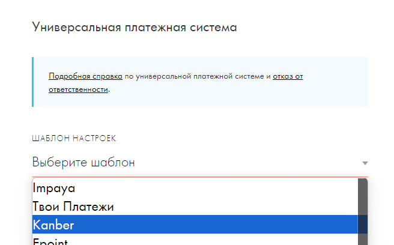

# Настройка для Tilda ⚡

Приветствуем и благодарим тебя за пользование нашим сервисом **kanber.ru**

# 1. Получение ключей YandexPay ⚡

Для начала работы с сервисом нужно получить несколько ключей [здесь](https://console.pay.yandex.ru/web/account/settings/online)

> [!TIP]
> Еще нужно установить Callback URL - https://api.kanber.ru/api/v1/payments/yandex-pay

И еще, нужно выпустить ключ, это чуть ниже, скопируйте ключ сохраните его, ID ключа не нужен

# 2. Настройка Tilda ⚡

Заходим в [Профиль](https://tilda.ru/identity/), включаем галочку "Участвовать в тестировании новых функций" и нажимаем "Сохранить".

Заходим в Настройки сайта -> Платежные системы -> Универсальная платежная система.

Выбираем шаблон "Kanber"

В поле Логин прописываем **`Логин платежной системы` из ЛК Kanber**

В поле секретный ключ прописываем **`Секрет для подписи заказа`** из ЛК Kanber

Поле “URL ДЛЯ УВЕДОМЛЕНИЙ” можете оставить пустым

Заполняем валюту (пока поддерживается только RUB), налоги, ФФД на своё усмотрение