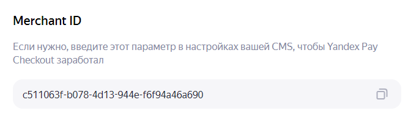
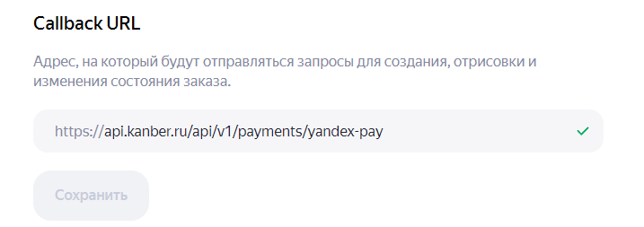

# Приветствие 👋

Приветствуем и благодарим тебя за пользование нашим сервисом **kanber.ru**

# 1. Получение ключей YandexPay ⚡

Для начала работы с сервисом нужно получить несколько ключей [здесь](https://console.pay.yandex.ru/web/account/settings/online)

> [!TIP]
> Еще нужно установить Callback URL - https://api.kanber.ru/api/v1/payments/yandex-pay

И еще, нужно выпустить ключ, это чуть ниже, скопируйте ключ сохраните его, ID ключа не нужен

# 2. Настройка Tilda ⚡

Заходим в Настройки сайта -> Платежные системы -> Универсальная платежная система.

Выбираем "Новая платежная система (для разработчиков)"

В поле Логин прописываем **`Логин платежной системы` из ЛК Kanber**

В поле секретный ключ прописываем **`Секрет для подписи заказа`** из ЛК Kanber

Поле “URL ДЛЯ УВЕДОМЛЕНИЙ” пока оставить пустым

Заполняем валюту (пока поддерживается только RUB), налоги, ФФД на своё усмотрение

Раскрываем меню "**РАСШИРЕННЫЕ НАСТРОЙКИ"**

В "API URL" пишем https://api.kanber.ru/api/v1/tilda/v1/checkout

## Начинаем заполнять поля в расширенных настройках

Название поля | Значение | Доп. информация
--- | --- | ---
API URL | https://api.kanber.ru/api/v1/tilda/v1/checkout |  
Тестовый API URL | https://api.kanber.ru/api/v1/tilda/v1/checkout |  
Логин	 | login	 |  
Валюта	 | currency | RUB/USD/… 
Язык	 | lang | Верхний регистр 
Страна	 | country | Верхний регистр 
URL для уведомлений | notifyUrl |  
Номер заказа | orderld | <ID проекта>.<ID заказа> 
Описание заказа | orderDescription |  
Сумма заказа	 | total | В рублях/долларах/… 
Email покупателя | customerEmail |  
Телефон покупателя | customerPhone | Без изменений 
Имя покупателя | customerName | Имя (или ФИО, если пусто) 
Подпись	 | signature |  
Товары	 | items | Массив JSON
Порядковый номер | num | С единицы 
Название | name |  
Количество | quantity |  
Цена | price | В рублях/долларах/… 
Полная стоимость | total | В рублях/долларах/… 
Фото | photo | 
Добавлять доставку в список товаров | Да 
Использовать цену со скидкой для товаров | Да
ФФД 1.05 | receipt | Массив в JSON
Использовать цену со скидкой в массиве ФФД | Да

## Подпись заказа

Правила подписи | Особые правила
--- | ---
Особые правила подписи | `{{login}}{{total}}{{orderId}}{{notifyUrl}}{{items}}{{receipt}}{{secret}}`
Алгоритм шифрования | SHA-256
Использовать секрет в качестве ключа алгоритма (HMAC) | Нет
Преобразовать к верхнему регистру | Нет
Преобразовать итоговую подпись в base64 | Нет

## Подпись уведомления

Правила подписи | Особые правила
--- | ---
Использовать аналогичные правила для подписи уведомления | Нет
ПРАВИЛА ПОДПИСИ | Особые правила
ОСОБЫЕ ПРАВИЛА ПОДПИСИ | `{{orderId}}{{status}}{{secret}}`
Алгоритм шифрования | SHA-256
Использовать секрет в качестве ключа алгоритма (HMAC) | Нет
Преобразовать к верхнему регистру | Нет
Преобразовать итоговую подпись в base64 | Нет

## Уведомление 

Название поля | Значение | Доп. информация
--- | --- | ---
ПРИЗНАК УСПЕШНОГО ПЛАТЕЖА | status | SUCCESS
ИДЕНТИФИКАТОР ТРАНЗАКЦИИ | operationId | Произвольный
ОТВЕТ ОБ УСПЕХЕ УВЕДОМЛЕНИЯ | OK |
ОТВЕТ ОБ ОШИБКЕ УВЕДОМЛЕНИЯ | ERROR | 
Ответы на уведомление в формате json | Нет | 

Раздел “ПОДДЕРЖКА”, требуется только для подачи шаблона в общий доступ тильды, заполнять не нужно

Пролистываем в самый низ, заполняем Заголовок и сохраняем.

Снова открываем страницу этой платежной системы, вверху страницы ищем поле “URL ДЛЯ УВЕДОМЛЕНИЙ”, там должна была появится ссылка, копируем её и вставляем в поле `URL для уведомлений` в ЛК Kanber.