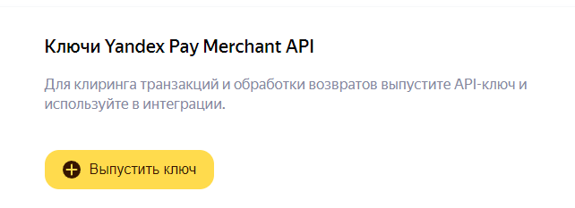
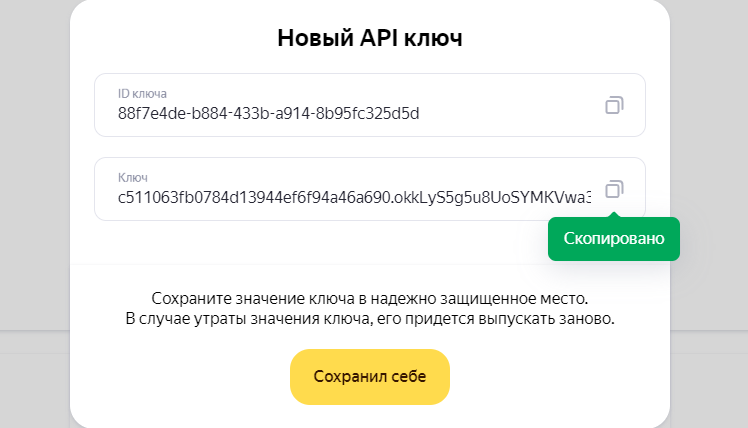
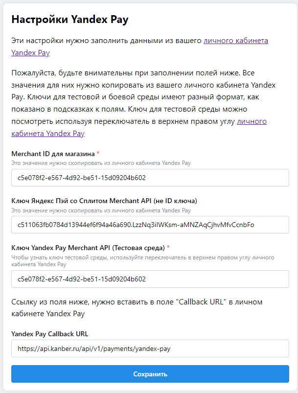
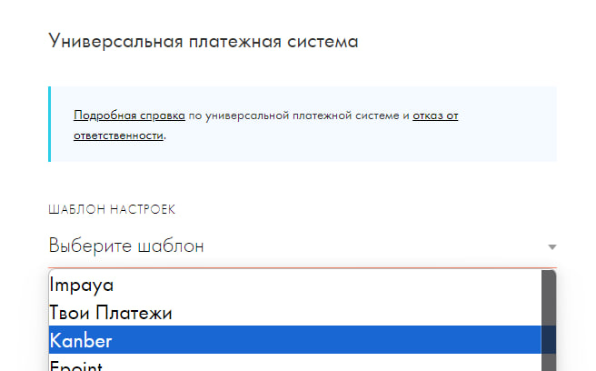
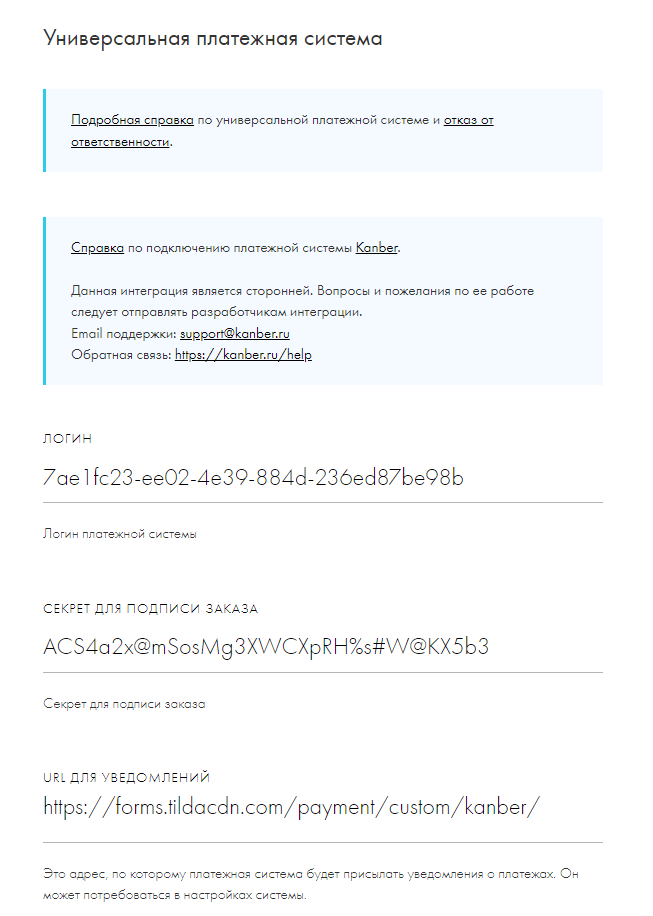
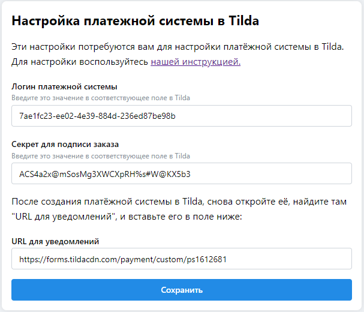
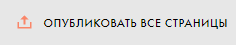

# Настройка для Tilda ⚡

Приветствуем и благодарим тебя за пользование нашим сервисом **kanber.ru**

Для начала работы с интеграцией нужно сделать несколько вещей:
1. Получить ключи YandexPay
2. Настроить ключи внутри личного кабинета kanber.ru
3. Настроить ключи логин и секрет в Tilda

Для начала работы с сервисом нужно получить несколько ключей [здесь](https://console.pay.yandex.ru/web/account/settings/online)

> [!TIP]
> Еще нужно установить Callback URL - https://api.kanber.ru/api/v1/payments/yandex-pay

Нужно выключить тестовую среду, чтобы получить ключ YandexPay основной среды

Нажимаем здесь "выпустить ключ", копируем из поля "Ключ" по кнопке ключ и вставляем его в ЛК kanber.ru

Настройка в итоге должна выглядеть примерно вот так

Внутри Tilda нужно настроить данные для интеграции

Заходим в Настройки сайта -> Платежные системы -> Универсальная платежная система.

Выбираем шаблон "Kanber"

В поле Логин прописываем **`Логин платежной системы` из ЛК Kanber**

В поле секретный ключ прописываем **`Секрет для подписи заказа`** из ЛК Kanber

Важно, не забудьте нажать кнопку "Сохранить" в Tilda и в ЛК Kanber

Заполняем валюту (пока поддерживается только RUB), налоги, ФФД на своё усмотрение

Очень важно после настройки интеграции переопубликовать все страницы, как вот здесь, на странице где расположены все страницы

В случае возникновения проблем с интеграцией можно обратиться к нам в телеграме https://t.me/kanberbot